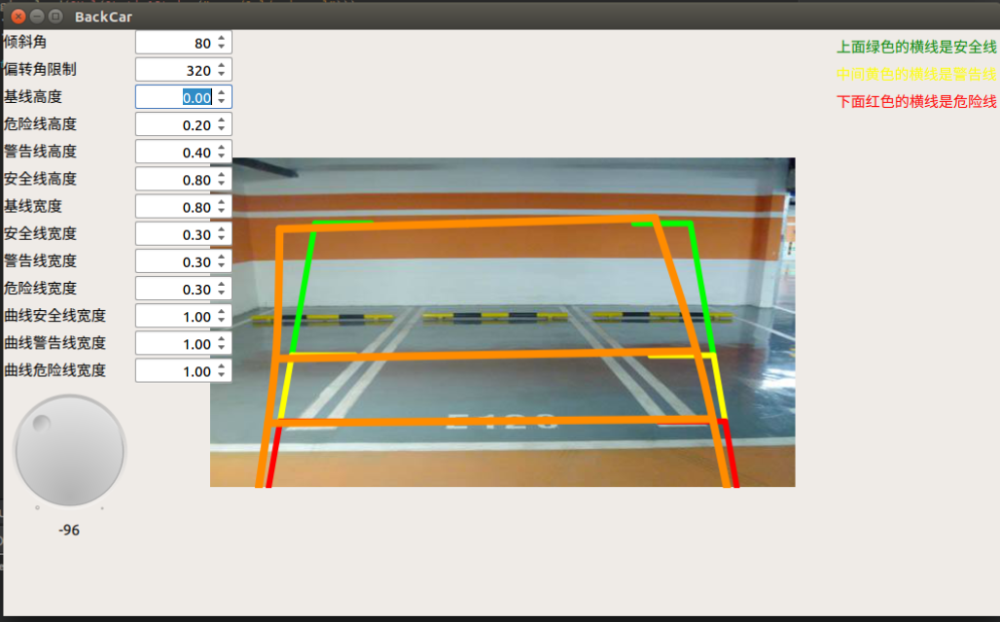

# 基于Qt5.9的Qml例子合集

## DragResize

qml Rectangle + MouseArea 实现拖拽改变item大小

* 鼠标在Item内悬浮时，鼠标图标变为拖拽样式，拖拽改变Item坐标

* 鼠标在Item角落时，鼠标图标变为拖拽样式，拖拽可以改变Item 坐标和宽、高

## BackCarLine

基于QQuickPaintedItem，使用QPainter模拟绘制的倒车轨迹线

* 倒车角度可调

* 任意线宽度、高度可调

* 调节好的参数关闭时自动保存，启动时自动加载

* I18n
